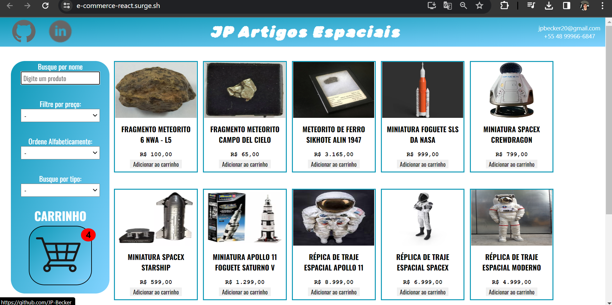
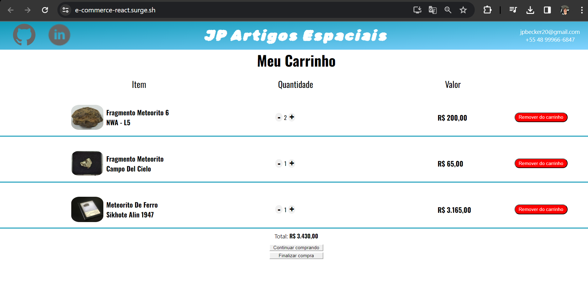

# e-Commerce de artigos espaciais


## Introdução

Projeto desenvolvido em React com o objetivo de implementar um e-Commerce de artigos espaciais.

Nesse projeto botei em prática conhecimentos e conceitos importantes, como: JSX, Componentes, Props, Estado, Fluxo de dados no React, Styled-components, Renderização de listas e Renderização condicional. 

## 🔗Link de Acesso
- Deploy Surge: [Clique aqui!](https://e-commerce-react.surge.sh/).


### Instalando
```bash
# Instalando dependências
npm install

# executando o projeto
npm start
```

### Layout (HomePage)

| <br> |
| :---: |

### Layout (Meu Carrinho)

| <br> |
| :---: |

## Descrição das funcionalidades

1. Main page
    - A pagina exibirá uma lista de todos os produtos disponiveis no e-commerce, com os dados do produto (imagem, nome, preço) que poderão ser adicionados no carrinho pelo botão de "Compra". Podendo ser ordenado pela ordem do Preço Maior para o Menor e vice-versa.
    - O menu de navegação do lado esquerdo permite realizar o filtro de produtos por valor, ordem alfabética, tipo e buscar os produtos por nome, contando também com o botão que leva a pagina do carrinho e possui um pop-up vermelho com o número de itens existentes no carrinho.

2. Página do carrinho
    - Exibe a lista dos produtos que foram adicionados ao carrinho na área central, com quantidade, preço, nome e imagem. 
    - Possui um botão para remover no canto direito de cada item para remove-lo e um botão para aumentar ou diminuir a quantidade.
    - Se tiver apenas uma unidade do produto e o botao de diminuir for pressionado o produto é removido.
    - Abaixo dos produtos tem o Valor total dos itens do carrinho, e um botão "Continuar comprando" que leva o usuário de volta a página inicial e um botão "Finalizar compra" que leva para página final.

3. Página final
    - Página criada com o intuito de ser meramente ilustrativa. Possuindo meu e-mail e telefone para contato.

### Bibliotecas Utilizadas

```bash
styled-components
axios
react-router-dom
```

## 💡IDE utilizada:
- VSCode

- ## 💻Tecnologias 


## Contato

E-mail: jpbecker20@gmail.com

Whatsapp: +55 48 99966-6847
